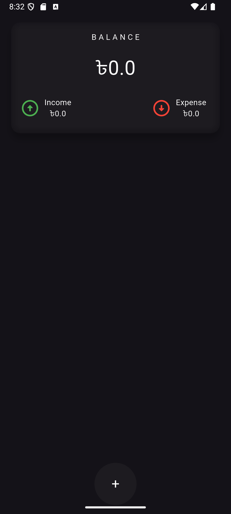
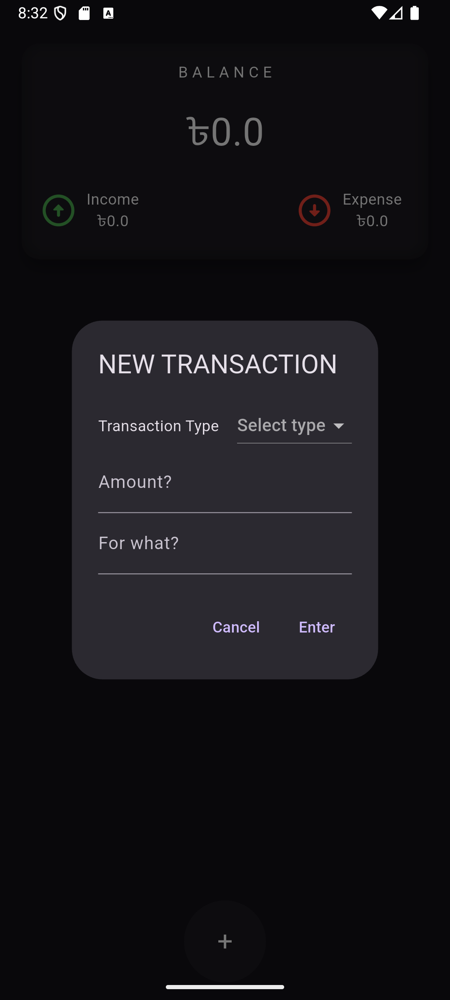
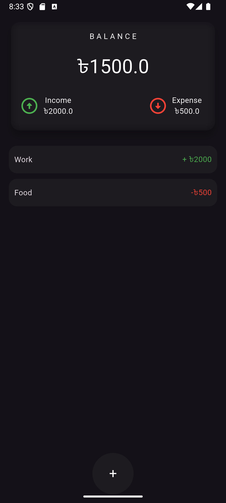

# 💳 Expense Tracker App

A simple and intuitive **Expense Tracker** app built with **Flutter**. The app helps users manage their finances by tracking income, expenses, and balance. 📊

---

## 🚀 Features

* **Track Your Balance:** Get an overview of your total balance, income, and expenses. 💰
* **Add Income/Expense:** Easily log your transactions with a clean and simple UI. ➕
* **Transaction History:** View a detailed log of all your financial activities. 📜
* **Minimalist Design:** Enjoy a sleek and user-friendly interface. ✨

---

## 📸 Screenshots

### 🏠 Dashboard:
Track your total balance, income, and expenses at a glance.

<p float="left">
  
</p>

---

### ➕ Add a Transaction:
Log income or expenses with a simple and intuitive dialog box.

<p float="left">
  
</p>

---

### 📜 Transaction History:
View a detailed log of your recent financial activities.

<p float="left">
  
</p>

---

## 💡 How to Use

1. **View Your Dashboard:** See an overview of your total balance, income, and expenses. 🏠
2. **Add a Transaction:** Tap the `+` button to log income or expenses. ➕
3. **Fill in Details:** Enter the transaction type, amount, and description. 📝
4. **Track Your History:** View all transactions in the history section. 📜

---

## 🛠️ Getting Started with Development

To get a local copy up and running, follow these simple steps. 🔧

### 📥 Prerequisites

This project requires Flutter to be installed on your machine.

* Flutter SDK: [Flutter Installation Guide](https://flutter.dev/docs/get-started/install)

### ⚙️ Installation

1. Clone the repo:

    ```bash
    git clone https://github.com/OnoPUNPUN/expense_tracker.git
    ```

2. Navigate to the project directory:

    ```bash
    cd expense_tracker
    ```

3. Get Flutter packages:

    ```bash
    flutter pub get
    ```

4. Run the app:

    ```bash
    flutter run
    ```

---

## 🤝 Contributing

Contributions are welcome! If you have suggestions to improve the app, please fork the repo and create a pull request. You can also open an issue with the tag "enhancement" for suggestions. 🙌

1. Fork the Project 🍴
2. Create your Feature Branch (`git checkout -b feature/AmazingFeature`) 🌱
3. Commit your Changes (`git commit -m 'Add some AmazingFeature'`) 📝
4. Push to the Branch (`git push origin feature/AmazingFeature`) 🚀
5. Open a Pull Request 🔄

---

## 📞 Contact

For any questions, suggestions, or feedback, feel free to reach out! 💬

- Email: tonmoywasimul04@gmail.com 📧
- Project Link: [Expense Tracker App GitHub](https://github.com/OnoPUNPUN/expense_tracker.git)

--- 